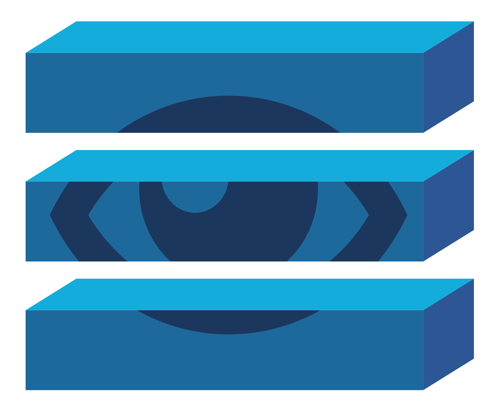

# Stack Auditor



## Installation

* Download the latest stack-auditor from the [release section](https://github.com/cloudfoundry/stack-auditor/releases) of this repository. 
* Unpack the archive on your local box using `tar xvzf <archive> [-C <directory>]` or use a file explored. 
* Install the plugin with `cf install-plugin <path_to_binary>`.

### Alternative: Compile from source

Prerequisite: Have a working golang environment with correctly set
`GOPATH`.

```sh
go get github.com/cloudfoundry/stack-auditor
cd $GOPATH/src/github.com/cloudfoundry/stack-auditor
./scripts/build.sh

```

## Usage

Install the plugin with `cf install-plugin <path_to_binary>` or use the shell scripts `./scripts/install.sh` or `./scripts/reinstall.sh`.

* Audit cf applications using `cf audit-stack`
* Change stack association using `cf change-stack <app> <stack> [--v3]`. Setting the `--v3` flag will attempt to perform a zero downtime restart. Make sure to target the space that contains the app you want to re-associate. 
**NOTE** The `--v3` flag is experimental.
* Delete a stack using `cf delete-stack <stack> [--force | -f]`

## Run the Tests

Target a cloudfoundry and run:

`./scripts/all-tests.sh` 
